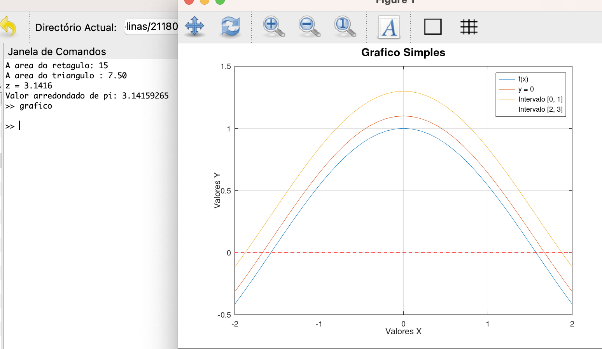

<h1 align="center">
    
</h1>

📌 Exemplos Basicos em Octave
------------------

## OCTAVE

1. **Instalação do Octave:**
    - Comece instalando o Octave em seu sistema, o que é geralmente um processo simples. Você pode baixar a versão mais recente no site oficial do Octave.
    - Para instalar Octave: https://octave.org/download
2. **Ambiente de Desenvolvimento:**
    - Familiarize-se com o ambiente de desenvolvimento do Octave, que é semelhante ao MATLAB. A janela de comando é onde você pode digitar comandos Octave e ver as saídas.(terminal)
3. **Operações Básicas:**
    - Aprenda a realizar operações matemáticas básicas, como adição, subtração, multiplicação e divisão.
4. **Variáveis e Atribuição:**
    - Saiba como criar variáveis e atribuir valores a elas.
5. **Vetores e Matrizes:**
    - Entenda como criar e manipular vetores e matrizes. O Octave é especialmente eficaz para lidar com cálculos matriciais.
6. **Funções e Scripts:**
    - Aprenda a definir funções e scripts. Funções são blocos de código reutilizáveis, enquanto scripts são arquivos de código que podem ser executados.
7. **Gráficos:**
    - Explore a criação de gráficos e visualizações com o Octave. A biblioteca **`plot`** é útil para plotar dados.
8. **Resolução de Problemas:**
    - Pratique resolvendo problemas matemáticos e científicos usando o Octave. Essa é uma ótima maneira de aplicar o que você aprendeu.
9. **Recursos Online:**
    - Há uma série de tutoriais, documentação e recursos online para aprender Octave. Consulte fóruns, grupos de discussão e sites dedicados ao Octave.

ViDEO:
https://youtu.be/l9HfpkaBvDA

🔧 Tecnologias utilizadas:
------------------

- <strong>Octave</strong>
- <strong>MacOS</strong>

💬 Fale comigo
------------------
[*Entre em contato comigo*](https://www.linkedin.com/in/ivo-baptista-3712144/)

